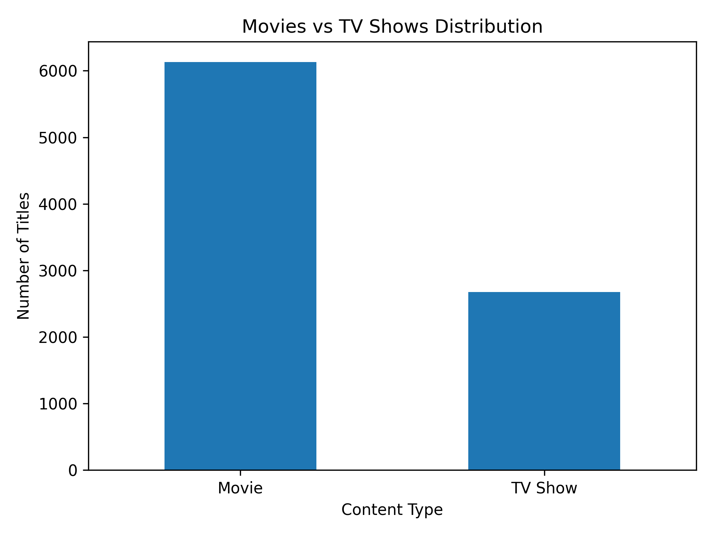
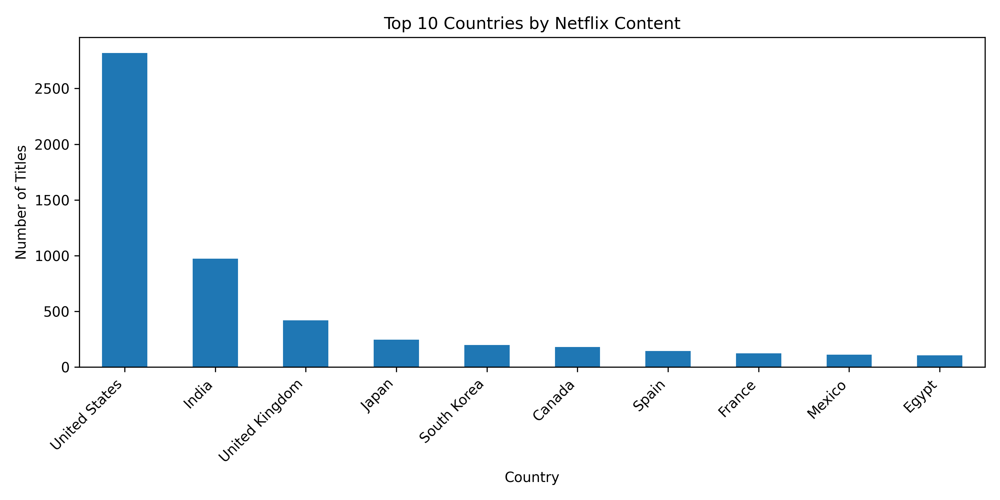
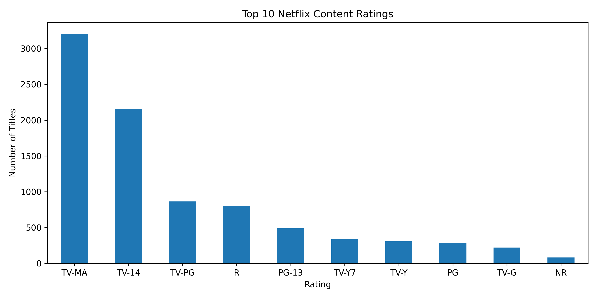
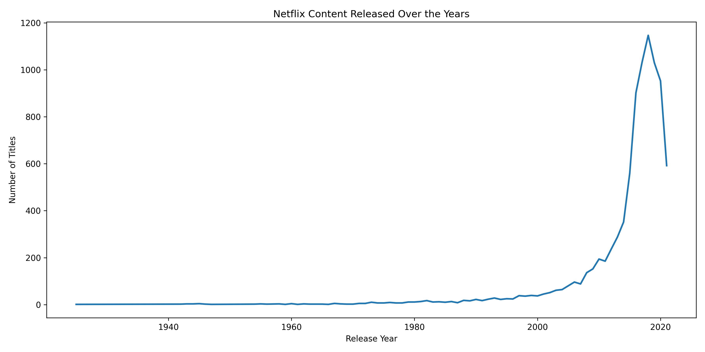
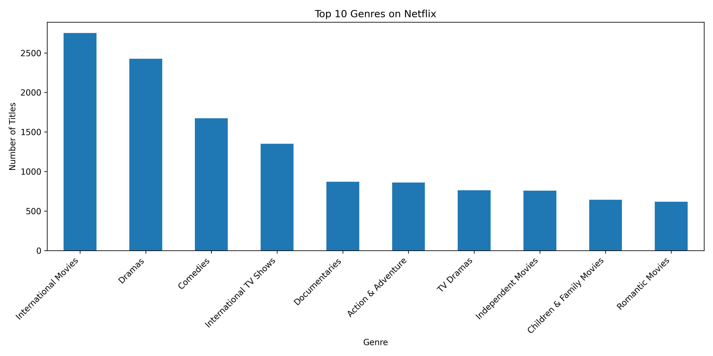
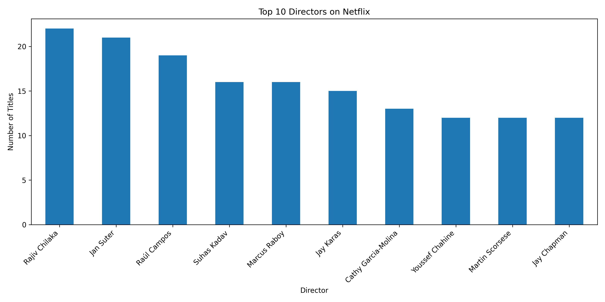
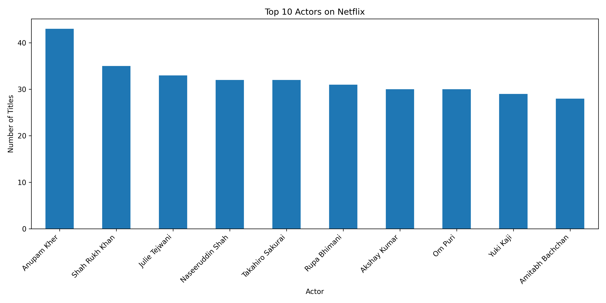
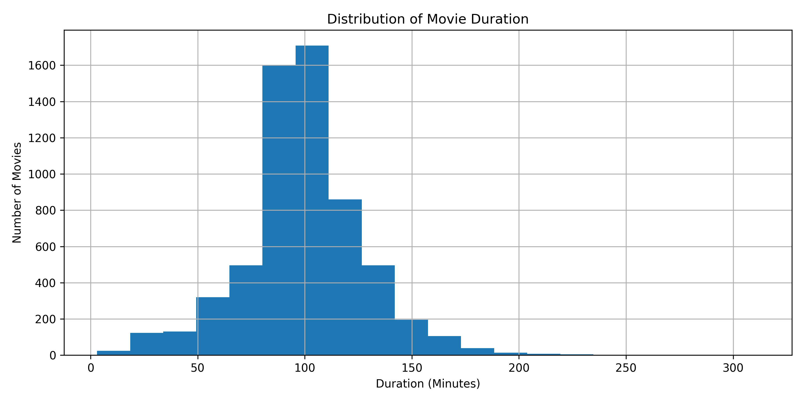
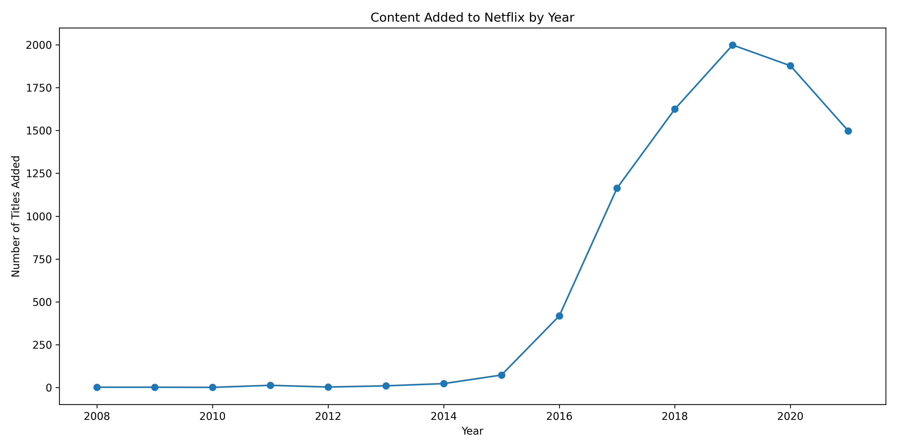

# 🎬 Netflix Data Analysis using Python

A complete Exploratory Data Analysis (EDA) project on the Netflix Titles dataset using **Python**, **Pandas**, and **Matplotlib**. This project analyzes Netflix's content library to uncover trends, generate business insights, and visualize key patterns.

---

## 📌 Project Overview

This project focuses on exploring the Netflix Movies and TV Shows dataset to understand content distribution, ratings, genres, release trends, directors, actors, and movie durations.

The analysis demonstrates the complete EDA workflow including:

- Data Loading
- Data Cleaning
- Data Exploration
- Data Visualization
- Business Insights

---

## 🎯 Objectives

- Analyze Netflix Movies vs TV Shows
- Identify top content-producing countries
- Analyze content ratings
- Explore release year trends
- Discover the most popular genres
- Identify top directors and actors
- Analyze movie duration distribution
- Generate business insights from data

---

## 🛠️ Technologies Used

- Python
- Pandas
- NumPy
- Matplotlib
- Jupyter Notebook
- Git
- GitHub

---

## 📂 Project Structure

```text
Netflix-Data-Analysis/
│
├── Dataset/
│   └── netflix_titles.csv
│
├── Notebook/
│   └── netflix_data_analysis.ipynb
│
├── Screenshots/
│   ├── movies_vs_tvshows.png
│   ├── top_10_countries.png
│   ├── top_10_ratings.png
│   ├── content_by_release_year.png
│   ├── top_10_genres.png
│   ├── top_10_directors.png
│   ├── top_10_actors.png
│   ├── movie_duration_distribution.png
│   └── content_added_by_year.png
│
├── requirements.txt
└── README.md
```
---

## 📊 Business Questions

This project answers the following business questions:

1. What is the distribution of Movies vs TV Shows on Netflix?
2. Which countries produce the most Netflix content?
3. What are the most common content ratings?
4. How has Netflix's content library changed over the years?
5. Which genres are most popular?
6. Which directors have the highest number of titles?
7. Which actors appear most frequently?
8. What is the distribution of movie durations?
9. How has content addition changed over time?

---

## 📈 Analysis Performed

✔ Data Loading

✔ Data Cleaning

✔ Missing Value Analysis

✔ Duplicate Record Check

✔ Movies vs TV Shows Distribution

✔ Top 10 Countries

✔ Top 10 Content Ratings

✔ Content Released by Year

✔ Top 10 Genres

✔ Top 10 Directors

✔ Top 10 Actors

✔ Movie Duration Distribution

✔ Content Added by Year

✔ Business Insights & Conclusion

---

## 💡 Key Business Insights

- Movies make up the majority of Netflix's content library.
- The United States contributes the highest number of titles.
- TV-MA is the most common content rating.
- Netflix's content library has grown significantly over recent years.
- International Movies and Dramas are among the most popular genres.
- A small number of directors and actors appear frequently across Netflix titles.
- Most movies have a duration between **80–120 minutes**, indicating a preference for standard feature-length films.
- Netflix rapidly expanded its content additions after 2015.
---

## 📸 Project Screenshots

### Movies vs TV Shows Distribution



---

### Top 10 Countries



---

### Top 10 Content Ratings



---

### Content Released by Year



---

### Top 10 Genres



---

### Top 10 Directors



---

### Top 10 Actors



---

### Movie Duration Distribution



---

### Content Added by Year



---

## 💻 Skills Demonstrated

- Python Programming
- Data Cleaning
- Exploratory Data Analysis (EDA)
- Data Visualization
- Business Insight Generation
- Pandas
- NumPy
- Matplotlib
- Git & GitHub

---

## 🔮 Future Improvements

- Create an interactive dashboard using Power BI or Tableau.
- Perform sentiment analysis on Netflix content descriptions.
- Build a recommendation system using machine learning.
- Develop an interactive web dashboard using Streamlit.

---

## 👨‍💻 Author

**Pratik Shigwan**

Aspiring Data Analyst passionate about transforming raw data into meaningful business insights using **SQL, Python, Excel, and Power BI**.

---

⭐ If you found this project useful, consider giving it a **Star** on GitHub!